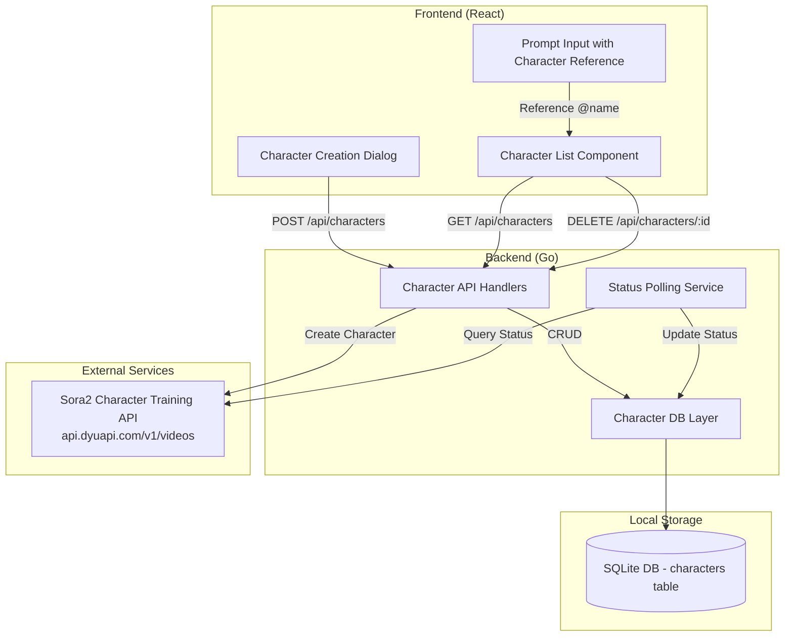

# Design Document

## Overview

本功能为视频生成系统增加角色创建和管理能力。通过调用 Sora2 Character Training API，用户可以从已生成的视频或外部视频 URL 中提取角色，并为角色设置自定义名称。系统维护 API 角色 ID 与自定义名称的映射关系，使用户可以用友好的名称引用角色。

角色训练是异步过程，系统需要轮询 API 获取训练进度，直到训练完成或失败。

## Architecture



## Components and Interfaces

### Sora2 Character Training API

Base URL: `https://api.dyuapi.com`

#### Create Character from Task ID
```
POST /v1/videos
Content-Type: application/json
Authorization: Bearer {API_KEY}

{
    "character": "video_ac587076-b36f-4854-ade8-8fdb4e255a48",
    "prompt": "角色创建",
    "model": "character-training",
    "timestamps": "1,3"
}
```

#### Create Character from Video URL
```
POST /v1/videos
Content-Type: application/json
Authorization: Bearer {API_KEY}

{
    "url": "https://example.com/video.mp4",
    "prompt": "角色创建",
    "model": "character-training",
    "timestamps": "1,2"
}
```

#### Response
```json
{
    "created_at": 1234567890,
    "id": "video_xxx",
    "model": "character-training",
    "object": "video",
    "progress": 0,
    "size": "1080p",
    "status": "pending"
}
```

### Backend API Endpoints

| Endpoint | Method | Description |
|----------|--------|-------------|
| `/api/characters` | POST | 创建新角色（提交训练任务） |
| `/api/characters` | GET | 获取所有角色列表 |
| `/api/characters/:id` | DELETE | 删除角色 |
| `/api/characters/:id/status` | GET | 查询角色训练状态 |

### Request/Response Interfaces

#### POST /api/characters - Create Character

Request:
```json
{
  "custom_name": "string (1-10 chars)",
  "description": "string (1-500 chars)",
  "source_type": "task | url",
  "source_value": "string (task_id or video URL)",
  "timestamps": "string (format: 'start,end', e.g. '1,3', range 1-3 seconds)"
}
```

Response:
```json
{
  "id": "number",
  "api_character_id": "string (e.g. video_xxx)",
  "custom_name": "string",
  "description": "string",
  "source_type": "task | url",
  "source_value": "string",
  "timestamps": "string",
  "status": "pending | processing | completed | failed",
  "progress": "number (0-100)",
  "created_at": "ISO8601 timestamp"
}
```

#### GET /api/characters - List Characters

Response:
```json
{
  "characters": [
    {
      "id": "number",
      "api_character_id": "string",
      "custom_name": "string",
      "description": "string",
      "source_type": "task | url",
      "source_value": "string",
      "timestamps": "string",
      "status": "pending | processing | completed | failed",
      "progress": "number",
      "created_at": "ISO8601 timestamp"
    }
  ]
}
```

#### DELETE /api/characters/:id - Delete Character

Response:
```json
{
  "success": true,
  "message": "Character deleted successfully"
}
```

#### GET /api/characters/:id/status - Query Training Status

Response:
```json
{
  "id": "number",
  "api_character_id": "string",
  "status": "pending | processing | completed | failed",
  "progress": "number",
  "fail_reason": "string (optional, only when failed)"
}
```

### Frontend Components

| Component | Description |
|-----------|-------------|
| `CharacterCreationDialog` | 角色创建弹窗，支持从任务或 URL 创建 |
| `CharacterList` | 角色列表展示组件，显示训练状态 |
| `CharacterCard` | 单个角色卡片，显示名称和状态 |

## Data Models

### SQLite Schema

```sql
CREATE TABLE IF NOT EXISTS characters (
    id INTEGER PRIMARY KEY AUTOINCREMENT,
    api_character_id TEXT,                 -- Sora2 返回的角色 ID (e.g. video_xxx)
    custom_name TEXT NOT NULL,             -- 用户自定义名称 (1-10字符)
    description TEXT,                      -- 人物描述词 (1-500字符)
    source_type TEXT NOT NULL,             -- 来源类型: 'task' 或 'url'
    source_value TEXT NOT NULL,            -- 来源值: task_id 或 video URL
    timestamps TEXT NOT NULL,              -- 时间戳范围 (e.g. '1,3')
    status TEXT DEFAULT 'pending',         -- 训练状态: pending, processing, completed, failed
    progress INTEGER DEFAULT 0,            -- 训练进度 (0-100)
    fail_reason TEXT,                      -- 失败原因 (仅当 status=failed 时)
    created_at DATETIME DEFAULT CURRENT_TIMESTAMP
);
```

### Go Structs

```go
// Character represents a character stored in the database
type Character struct {
    ID              int64     `json:"id"`
    ApiCharacterID  string    `json:"api_character_id,omitempty"`
    CustomName      string    `json:"custom_name"`
    Description     string    `json:"description,omitempty"`
    SourceType      string    `json:"source_type"`      // "task" or "url"
    SourceValue     string    `json:"source_value"`
    Timestamps      string    `json:"timestamps"`
    Status          string    `json:"status"`           // pending, processing, completed, failed
    Progress        int       `json:"progress"`
    FailReason      string    `json:"fail_reason,omitempty"`
    CreatedAt       time.Time `json:"created_at"`
}

// CreateCharacterRequest represents the request body for creating a character
type CreateCharacterRequest struct {
    CustomName  string `json:"custom_name"`
    Description string `json:"description"`
    SourceType  string `json:"source_type"`   // "task" or "url"
    SourceValue string `json:"source_value"`
    Timestamps  string `json:"timestamps"`
}

// Sora2CharacterRequest represents the request body for Sora2 Character Training API
type Sora2CharacterRequest struct {
    Character  string `json:"character,omitempty"`  // task_id when source_type is "task"
    URL        string `json:"url,omitempty"`        // video URL when source_type is "url"
    Prompt     string `json:"prompt"`
    Model      string `json:"model"`                // always "character-training"
    Timestamps string `json:"timestamps"`
}

// Sora2CharacterResponse represents the response from Sora2 Character Training API
type Sora2CharacterResponse struct {
    CreatedAt  int64  `json:"created_at"`
    ID         string `json:"id"`
    Model      string `json:"model"`
    Object     string `json:"object"`
    Progress   int    `json:"progress"`
    Size       string `json:"size"`
    Status     string `json:"status"`
    FailReason string `json:"fail_reason,omitempty"`
}
```

### TypeScript Interfaces

```typescript
interface Character {
  id: number;
  api_character_id?: string;
  custom_name: string;
  description?: string;
  source_type: 'task' | 'url';
  source_value: string;
  timestamps: string;
  status: 'pending' | 'processing' | 'completed' | 'failed';
  progress: number;
  fail_reason?: string;
  created_at: string;
}

interface CreateCharacterRequest {
  custom_name: string;
  description: string;
  source_type: 'task' | 'url';
  source_value: string;
  timestamps: string;
}
```

## Correctness Properties

*A property is a characteristic or behavior that should hold true across all valid executions of a system-essentially, a formal statement about what the system should do. Properties serve as the bridge between human-readable specifications and machine-verifiable correctness guarantees.*

### Property 1: Custom name validation

*For any* string input as custom name, the validation function should return true if and only if the string length is between 1 and 10 characters (inclusive).

**Validates: Requirements 1.2**

### Property 2: Description validation

*For any* string input as description, the validation function should return true if and only if the string length is between 1 and 500 characters (inclusive).

**Validates: Requirements 1.3**

### Property 3: Timestamp range validation

*For any* pair of start and end seconds, the validation function should return true if and only if the difference (end - start) is between 1 and 3 seconds (inclusive) and start >= 0.

**Validates: Requirements 1.4**

### Property 4: Character storage completeness

*For any* valid character creation request, after creating a character and retrieving it from the database, all fields (api_character_id, custom_name, description, source_type, source_value, timestamps, status, progress) should match the original values.

**Validates: Requirements 4.1, 6.2**

### Property 5: Custom name to API character ID conversion

*For any* character with a custom name and API character ID, converting a prompt containing the custom name reference should produce a prompt with the correct API character ID.

**Validates: Requirements 4.3**

### Property 6: Character deletion removes record

*For any* existing character, after calling the delete endpoint, querying for that character should return not found.

**Validates: Requirements 5.3**

### Property 7: Character JSON serialization round-trip

*For any* valid Character struct, serializing to JSON and then deserializing back should produce an equivalent Character struct with all fields preserved.

**Validates: Requirements 6.3, 6.4**

### Property 8: Initial status is pending

*For any* newly created character, the initial status should be "pending" and progress should be 0.

**Validates: Requirements 3.1**

## Error Handling

### Backend Error Handling

| Error Scenario | HTTP Status | Response |
|----------------|-------------|----------|
| Invalid custom name length | 400 | `{"error": "Custom name must be 1-10 characters"}` |
| Invalid description length | 400 | `{"error": "Description must be 1-500 characters"}` |
| Invalid timestamp range | 400 | `{"error": "Timestamp range must be 1-3 seconds"}` |
| Invalid source type | 400 | `{"error": "Source type must be 'task' or 'url'"}` |
| Task not found | 404 | `{"error": "Task not found"}` |
| Invalid video URL | 400 | `{"error": "Invalid video URL"}` |
| Character not found | 404 | `{"error": "Character not found"}` |
| Sora2 API error | 500 | `{"error": "Failed to create character: {reason}"}` |
| Database error | 500 | `{"error": "Internal server error"}` |

### Frontend Error Handling

- 表单验证失败时显示内联错误提示
- API 请求失败时显示 toast 通知
- 创建成功时显示成功提示并关闭弹窗
- 训练失败时显示失败原因

## Testing Strategy

### Property-Based Testing

使用 Go 的 `testing/quick` 包进行属性测试，每个属性测试配置运行至少 100 次迭代。

```go
// Example property test annotation format:
// **Feature: character-creation, Property 1: Custom name validation**
func TestCustomNameValidation(t *testing.T) {
    // Property-based test implementation
}
```

### Unit Testing

- 测试验证函数（名称长度、描述长度、时间戳范围）
- 测试数据库 CRUD 操作
- 测试 JSON 序列化/反序列化
- 测试 API 端点的请求/响应处理
- 测试 Sora2 API 请求格式构建

### Test File Structure

```
backend/
├── character.go           # Character handlers and logic
├── character_test.go      # Unit tests
├── property_test.go       # Property-based tests (existing file)
```
