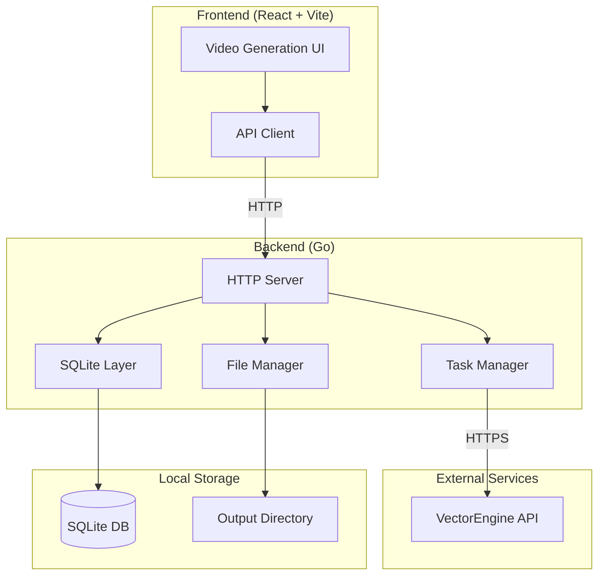

# Design Document

## Overview

本系统是一个视频生成应用，采用前后端分离架构。前端使用 React + TypeScript + Tailwind CSS 构建现代化 UI，后端使用 Go 语言实现 RESTful API 服务。系统通过调用 VectorEngine API 生成视频，使用 SQLite 进行数据持久化，支持视频文件的本地存储和管理。

## Architecture



## Components and Interfaces

### Backend API Endpoints

| Endpoint | Method | Description |
|----------|--------|-------------|
| `/api/tasks` | POST | 创建新的视频生成任务 |
| `/api/tasks` | GET | 获取所有任务历史记录 |
| `/api/tasks/:id` | GET | 获取单个任务状态和详情 |
| `/api/tasks/:id` | DELETE | 删除任务及其视频文件 |
| `/api/videos/:filename` | GET | 获取视频文件（静态文件服务） |

### Request/Response Interfaces

#### POST /api/tasks - Create Task

Request:
```json
{
  "prompt": "string",
  "image_url": "string (optional)",
  "duration": "10s | 15s",
  "orientation": "portrait | landscape"
}
```

Response:
```json
{
  "id": "number",
  "prompt": "string",
  "image_url": "string",
  "duration": "string",
  "orientation": "string",
  "status": "pending",
  "progress": 0,
  "created_at": "ISO8601 timestamp"
}
```

#### GET /api/tasks - List Tasks

Response:
```json
{
  "tasks": [
    {
      "id": "number",
      "prompt": "string",
      "image_url": "string",
      "duration": "string",
      "orientation": "string",
      "status": "pending | processing | completed | failed",
      "progress": "number (0-100)",
      "video_url": "string (external URL)",
      "local_path": "string (local filename)",
      "created_at": "ISO8601 timestamp",
      "updated_at": "ISO8601 timestamp"
    }
  ]
}
```

#### GET /api/tasks/:id - Get Task Status

Response: Same as single task object above

#### DELETE /api/tasks/:id - Delete Task

Response:
```json
{
  "success": true,
  "message": "Task deleted successfully"
}
```

### Frontend Components

| Component | Description |
|-----------|-------------|
| `App.tsx` | 主应用组件，管理全局状态和布局 |
| `VideoCard` | 视频卡片组件，展示单个视频/任务 |
| `InputBar` | 输入栏组件，处理提示词输入和图片上传 |
| `SettingsPopover` | 设置弹窗，配置时长和方向 |
| `api.ts` | API 客户端，封装后端请求 |

## Data Models

### SQLite Schema

```sql
CREATE TABLE IF NOT EXISTS tasks (
    id INTEGER PRIMARY KEY AUTOINCREMENT,
    task_id TEXT UNIQUE,           -- VectorEngine API 返回的任务 ID
    prompt TEXT NOT NULL,
    image_url TEXT,
    duration TEXT NOT NULL,        -- '10s' or '15s'
    orientation TEXT NOT NULL,     -- 'portrait' or 'landscape'
    status TEXT DEFAULT 'pending', -- pending, processing, completed, failed
    progress INTEGER DEFAULT 0,    -- 0-100
    video_url TEXT,                -- VectorEngine 返回的视频 URL
    local_path TEXT,               -- 本地保存的文件名
    created_at DATETIME DEFAULT CURRENT_TIMESTAMP,
    updated_at DATETIME DEFAULT CURRENT_TIMESTAMP
);
```

### Go Structs

```go
type Task struct {
    ID          int64     `json:"id"`
    TaskID      string    `json:"task_id"`
    Prompt      string    `json:"prompt"`
    ImageURL    string    `json:"image_url,omitempty"`
    Duration    string    `json:"duration"`
    Orientation string    `json:"orientation"`
    Status      string    `json:"status"`
    Progress    int       `json:"progress"`
    VideoURL    string    `json:"video_url,omitempty"`
    LocalPath   string    `json:"local_path,omitempty"`
    CreatedAt   time.Time `json:"created_at"`
    UpdatedAt   time.Time `json:"updated_at"`
}

type CreateTaskRequest struct {
    Prompt      string `json:"prompt"`
    ImageURL    string `json:"image_url,omitempty"`
    Duration    string `json:"duration"`
    Orientation string `json:"orientation"`
}

type VectorEngineCreateResponse struct {
    ID string `json:"id"`
}

type VectorEngineQueryResponse struct {
    Status   string `json:"status"`
    Progress int    `json:"progress"`
    VideoURL string `json:"video_url,omitempty"`
}
```

### TypeScript Interfaces

```typescript
interface Task {
  id: number;
  task_id: string;
  prompt: string;
  image_url?: string;
  duration: '10s' | '15s';
  orientation: 'portrait' | 'landscape';
  status: 'pending' | 'processing' | 'completed' | 'failed';
  progress: number;
  video_url?: string;
  local_path?: string;
  created_at: string;
  updated_at: string;
}

interface CreateTaskRequest {
  prompt: string;
  image_url?: string;
  duration: '10s' | '15s';
  orientation: 'portrait' | 'landscape';
}
```


## Correctness Properties

*A property is a characteristic or behavior that should hold true across all valid executions of a system-essentially, a formal statement about what the system should do. Properties serve as the bridge between human-readable specifications and machine-verifiable correctness guarantees.*

### Property 1: Task creation preserves all input fields

*For any* valid task creation request containing prompt, image_url, duration, and orientation, creating a task and then retrieving it should return a task with identical values for all input fields.

**Validates: Requirements 1.1, 1.2, 1.3**

### Property 2: Empty prompt without image is rejected

*For any* task creation request where the prompt is empty or whitespace-only AND image_url is empty, the Backend Service should reject the request with an appropriate error.

**Validates: Requirements 1.4**

### Property 3: Task status updates are persisted and retrievable

*For any* task and any valid status/progress update, after updating the task's status and progress in the database, querying for that task should return the updated status and progress values.

**Validates: Requirements 2.2, 2.3, 3.3, 3.4**

### Property 4: Video filenames are unique per task

*For any* two different tasks, the generated local filenames for their videos should be different.

**Validates: Requirements 3.2**

### Property 5: Task deletion removes database record

*For any* existing task, after calling the delete endpoint, querying for that task should return not found.

**Validates: Requirements 5.1, 5.2**

### Property 6: Task JSON serialization round-trip

*For any* valid Task struct, serializing to JSON and then deserializing back should produce an equivalent Task struct with all fields preserved.

**Validates: Requirements 6.2, 6.3, 6.4**

## Error Handling

### Backend Error Handling

| Error Scenario | HTTP Status | Response |
|----------------|-------------|----------|
| Invalid JSON body | 400 | `{"error": "Invalid request body"}` |
| Empty prompt without image | 400 | `{"error": "Prompt or image is required"}` |
| Task not found | 404 | `{"error": "Task not found"}` |
| VectorEngine API error | 500 | `{"error": "Failed to create video task"}` |
| Database error | 500 | `{"error": "Internal server error"}` |
| File download error | 500 | `{"error": "Failed to download video"}` |

### Frontend Error Handling

- API 请求失败时显示 toast 通知
- 网络错误时显示重试按钮
- 任务失败时在卡片上显示失败状态

## Testing Strategy

### Property-Based Testing

使用 Go 的 `testing/quick` 包或 `gopter` 库进行属性测试。

每个属性测试配置运行至少 100 次迭代。

```go
// Example property test annotation format:
// **Feature: video-generation-ui, Property 1: Task creation preserves all input fields**
func TestTaskCreationPreservesFields(t *testing.T) {
    // Property-based test implementation
}
```

### Unit Testing

- 测试 API 端点的请求/响应处理
- 测试数据库 CRUD 操作
- 测试文件名生成逻辑
- 测试 JSON 序列化/反序列化

### Test File Structure

```
backend/
├── main.go
├── main_test.go          # Unit tests
├── property_test.go      # Property-based tests
├── db.go
├── handlers.go
└── models.go

frontend/
├── src/
│   ├── api.ts
│   ├── api.test.ts       # API client tests
│   └── ...
```

## File Structure

```
project/
├── backend/
│   ├── go.mod
│   ├── go.sum
│   ├── main.go           # HTTP server entry point
│   ├── db.go             # SQLite database operations
│   ├── handlers.go       # API request handlers
│   ├── models.go         # Data structures
│   ├── vectorengine.go   # VectorEngine API client
│   ├── output/           # Generated video files
│   └── videogen.db       # SQLite database file
├── frontend/
│   ├── src/
│   │   ├── App.tsx       # Main application component
│   │   ├── api.ts        # Backend API client
│   │   ├── types.ts      # TypeScript interfaces
│   │   └── ...
│   └── ...
├── start.bat             # Windows startup script
└── build.bat             # Build script for Go executable
```
